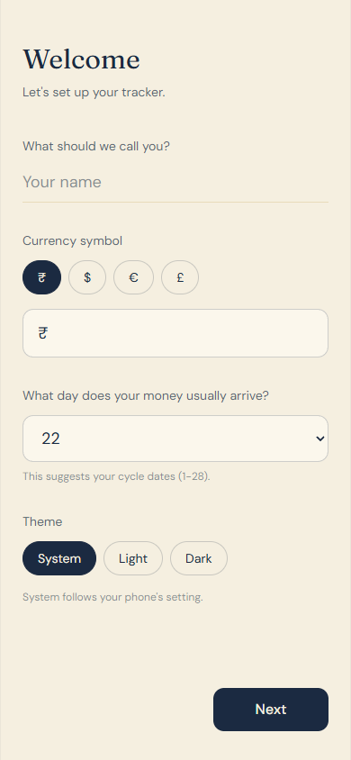
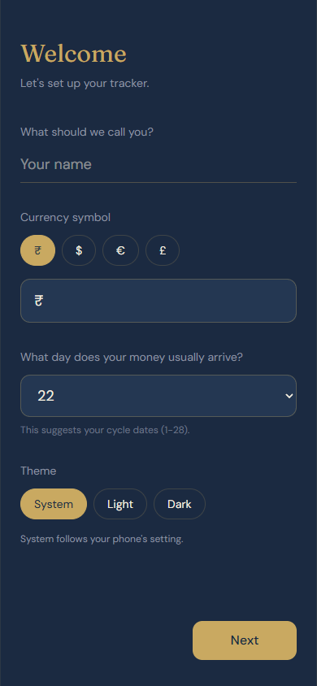

# Paylo

Paylo is a beautiful, offline-first, privacy-respecting expense tracker designed with a calm, premium aesthetic. It focuses on cycle-based budget tracking (e.g. from payday to payday) rather than strict calendar months.

## Features
- **Cycle-Based Tracking:** Track spending from payday to payday instead of rigid calendar months.
- **Privacy First:** There are no user accounts, no cloud backends, and no analytics. Everything stays strictly on your device using local storage (IndexedDB).
- **Offline & Installable:** Fully functional without an internet connection as a Progressive Web App (PWA).
- **Custom Categories:** Add your own categories with custom emojis and track spending breakdowns visually.
- **PIN Protection:** Secure your financial data with an optional 4-digit PIN.
- **Secure Backups:** Export your data locally. Choose between standard JSON or AES-GCM encrypted backups (PBKDF2 secured).
- **Dynamic Themes:** First-class light and dark mode support with smooth transitions.

## Screenshots

  
  
  
  

## Privacy & Data Storage
All your data lives **only on your device**. Paylo uses your browser's local `IndexedDB` storage. We do not run any servers, we do not track you, and your data never leaves your device unless you manually export a backup.

## Important Note for iPhone / iOS Users
1. **Install First:** Because Safari aggressively clears local storage for websites you don't visit often, **you MUST install Paylo to your Home Screen** before you start tracking. (Tap the Share icon > "Add to Home Screen").
2. **Back up Regularly:** Go to Settings and use the "Export Backup" feature regularly to ensure you never lose your data.

## Getting Started Locally
1. Clone the repository
2. Install dependencies: `npm install`
3. Run the development server: `npm run dev`
4. Run the test suite: `npx vitest run`

## Deploying to GitHub Pages
Paylo is pre-configured to be deployed anywhere, including GitHub Pages, because it uses a relative base path (`./`).
1. **Fork** this repository.
2. Go to your fork's **Settings** > **Pages**.
3. Under **Build and deployment**, select **GitHub Actions** as the source.
4. GitHub will automatically detect the Vite workflow (or you can set up a standard Node.js static build workflow).
5. Once the Action completes, your site will be live at `username.github.io/repo-name/`.

## Testing & Building
- **Test:** `npx vitest`
- **Build:** `npm run build`
- **Preview Production Build:** `npm run preview`

## Project Structure
- `/src/components` - Reusable UI components (buttons, sheets, lock screens)
- `/src/screens` - Main app views (Home, Cycles, History, Settings, Setup)
- `/src/lib` - Pure logic functions (savings, cycles, encryption, data formatting)
- `/src/hooks` - Global state and theme management hooks
- `/src/__tests__` - Comprehensive Vitest test suite ensuring robust mathematical accuracy
- `/public` - Static PWA assets (icons, fonts, manifest)

## Contributing
Contributions are welcome. Please ensure that all new features respect the offline-first philosophy and do not introduce backend dependencies or telemetry.

*Design note: Paylo maintains a calm, premium visual identity. Please adhere to the existing color tokens, typography (serif accents, clean sans-serif bodies), and micro-animations.*
